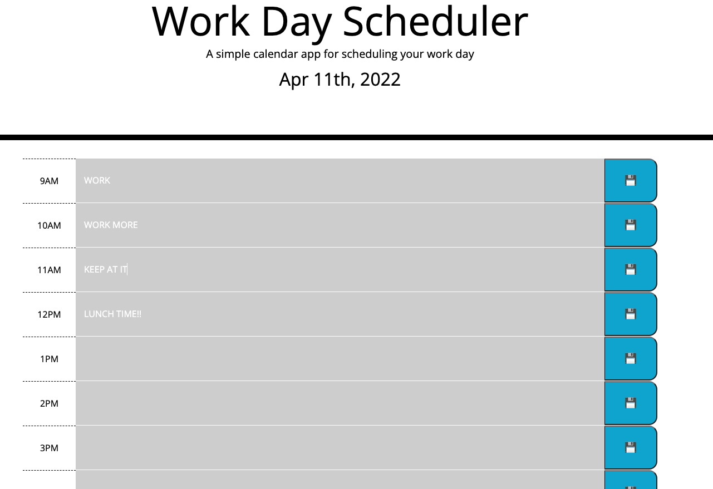

# DAY PLANNER

## This is a day planner application that allows the user to enter data into textareas for each hour of the work day (9AM- 5PM)

The day's date is printed at the top

Each field has a save button next to it to save the input text to local storage

The background of each text field is color coded based on if the hour of the day is past(gray), present(red), or future(green).

